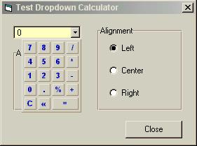

## Dropdown Calculator\.zip

### Description

It is like a combo box, but it will drop down a small calculator. i am sure you will find it very helpful for business softwares.
 
### More Info
 
subclassing has been implemented for the purpose of custon context menu and hot tracking.

             |
---                |---
**Submitted On**   |2000-12-08 18:15:04
**By**             |[Abdul Gafoor\.GK](https://github.com/Planet-Source-Code/PSCIndex/blob/master/ByAuthor/abdul-gafoor-gk.md)
**Level**          |Advanced
**User Rating**    |3.0 (15 globes from 5 users)
**Compatibility**  |VB 6\.0
**Category**       |[OLE/ COM/ DCOM/ Active\-X](https://github.com/Planet-Source-Code/PSCIndex/blob/master/ByCategory/ole-com-dcom-active-x__1-29.md)
**World**          |[Visual Basic](https://github.com/Planet-Source-Code/PSCIndex/blob/master/ByWorld/visual-basic.md)
**Archive File**   |[CODE\_UPLOAD124641282000\.zip](https://github.com/Planet-Source-Code/abdul-gafoor-gk-dropdown-calculator-zip__1-13427/archive/master.zip)

